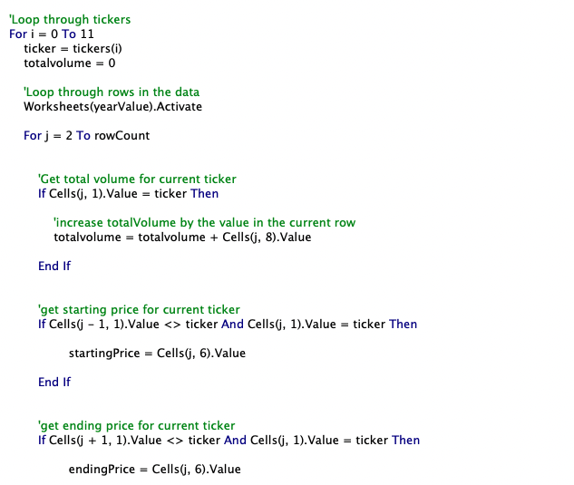
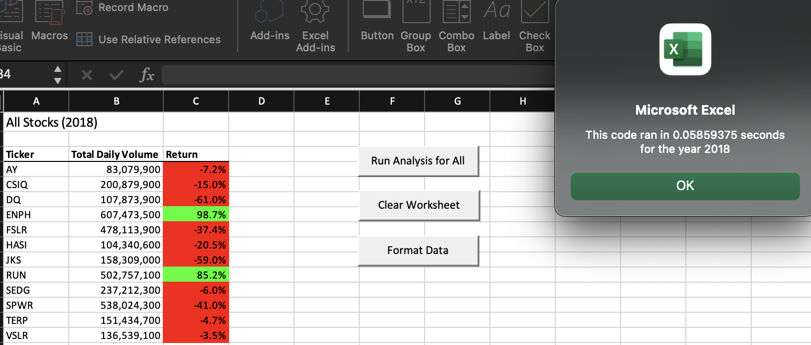
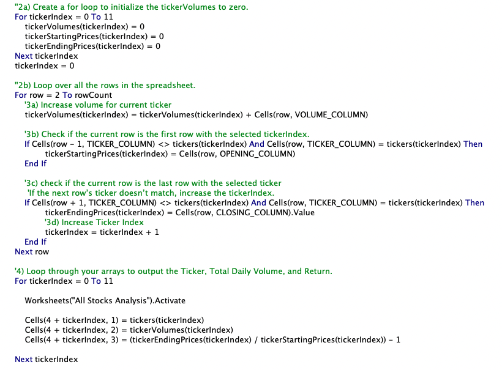

# VBA Challenge #2

## 1. Overview of Project:
  The purpose of this project is to refactor already existing code to make its processing time faster and more efficent for the user. The code created before was okay for smaller data sets, but when considering very large data sets. Making the code run more efficently will make larger data sets easier to run. 

## 2. Results: 

## Inital Code Results
  The inital code's analysis takes about .26 seconds to run for the 2018 data. 

  The inital code uses a few standard for-loops to run through the data sheets and produce the total volume as well as the return percentage. The return percentage was color coded: red was a negative return and green was a positive return.

## Refactored Code Results
  The refactored analysis takes about .058 seconds to run the 2018 data.
  

  The refactored code uses a 'ticker index' and 'output arrays' to run through the for-loops created in the initial code. By creating a ticker index and output arrays, we can speed up with run time by being able to hold an unspecified number of variables of the same type. This will make the code only loop through once instead of loop through for each stock listed. In this case, the variables would be the different stock options, if they increased to a larger number.

## 3. Summary: 

### - What are the advantages or disadvantages of refactoring code?
  One advantage of refactoring code is that a lot of the work is done for you. You are just tasked with adding or changing some code so it runs more efficiently with the data and for the user. A disadvantage in refactoring code is reading the inital code, usually created by someone else, and understanding how it runs. 

### - How do these pros and cons apply to refactoring the original VBA script?
  In this case, my pro and con were most certainly applied here since I had written much of the inital code myself, along with the course bootcamp during the module 2 exercises. One challenge I did have was changing the loops to have variables that had more meaning to the assignments then just "i" or "j". I wanted the code to tell a story, connected to the data it was retreiving information from, so readers could understand the steps I took without even looking at the data sets.
